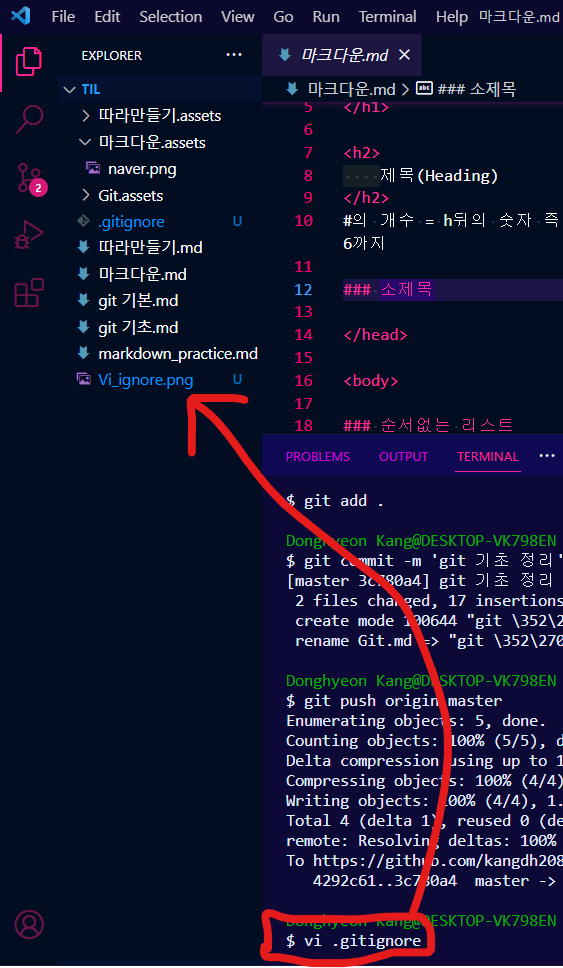
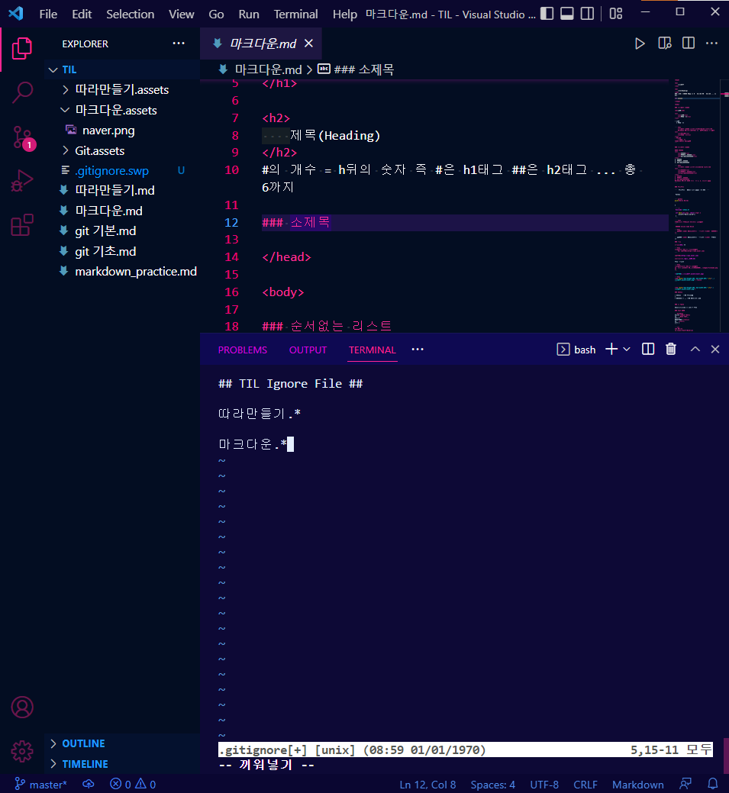

<h1>
    Git 기본
</h1>

<h3>
    Git Branch & Merge
</h3>

> `Branch` 는

> `Merge` 는 

<h3>
    Git.gitignore File
</h3>

> `.gitignore` 이란 프로젝트에 원치않는 파일들을 `git`에 제외시킬 수 있는 설정 파일

* *원치않는 파일들 예시* 

  * 보안상 위험성이 높은 파일

  * 프로젝트와 관계없는 파일

  * 용량이 너무 큰 파일

  * 백업 파일 등

1. **gitignore 파일 만들기**          >>주의!!         *항상 최상위 디렉토리에 존재해야 함

2. **gitignore 파일에 한 줄씩 제외할 파일이나 폴더 적기**

